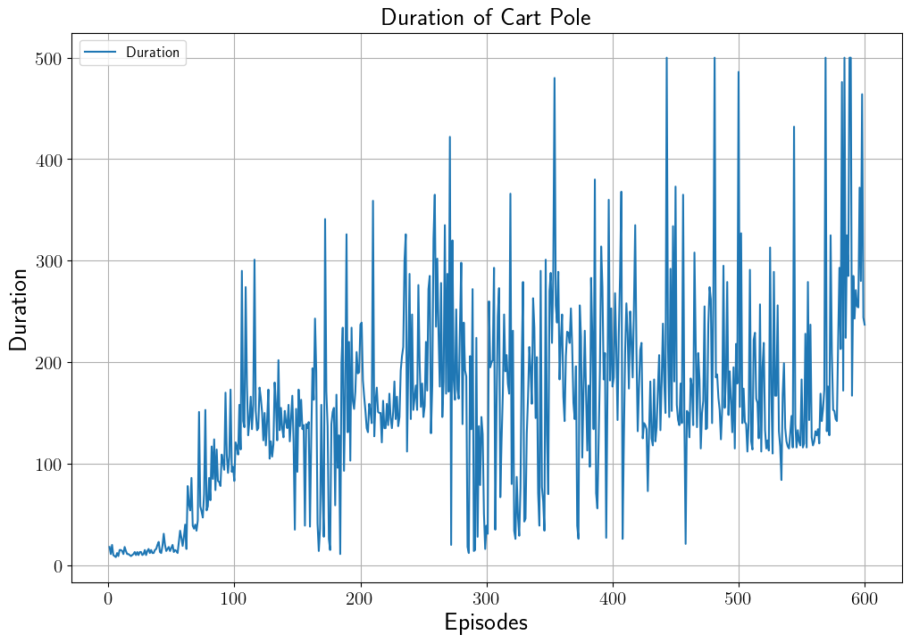

# Cart Pole Training using Deep Q Network
한국어 버전의 설명은 [여기](./docs/README_ko.md)를 참고하시기 바랍니다.

## Introduction
This code performs reinforcement learning on the Cart Pole environment using the [Deep Q Network (DQN)](https://arxiv.org/pdf/1312.5602.pdf) based on the gym library from [Gymnasimum](https://gymnasium.farama.org/).
DQN is a deep learning-based reinforcement learning algorithm that replaces the classical Q-learning method using a Q-table with a deep learning model.
For an explanation of Cart Pole DQN, please refer to [DQN을 이용한 Cart Pole 세우기](https://ljm565.github.io/contents/dqn2.html).
<br><br><br>

## Supported Models
### DQN
* DQN is implemented.
<br><br><br>


## Base Dataset
* Base dataset for tutorial is Cart Pole v1 of `gym==0.23.1`.
<br><br><br>


## Supported Devices
* CPU, GPU, MPS (for Mac and torch>=1.12.0)
<br><br><br>

## Quick Start
```bash
python3 src/run/train.py --config config/config.yaml --mode train
```
<br><br>

## Project Tree
This repository is structured as follows.
```
├── configs                          <- Folder for storing config files
│   └── *.yaml
│
└── src      
    ├── models
    |   └── dqn.py                   <- DQN model file
    |
    ├── run                   
    |   ├── train.py                  <- Training execution file
    |   └── video_generate.py         <- Code for generating training results
    |
    ├── tools                   
    |   ├── model_manager.py          
    |   └── training_logger.py        <- Training logger class file
    |
    ├── trainer                 
    |   ├── build.py                  <- Codes for initializing model
    |   └── trainer.py                <- Class for training, video generation
    |
    └── uitls                   
        ├── __init__.py               <- File for initializing the logger, versioning, etc.
        ├── filesys_utils.py       
        ├── model_utils.py       
        └── training_utils.py     
```
<br><br>


## Tutorials & Documentations
Please follow the steps below to train a DQN cart pole model.
1. [Getting Started](./docs/1_getting_started.md)
2. [Training](./docs/2_trainig.md)
3. ETC
   * [Video Generation](./docs/3_video_generation.md)

<br><br><br>

## Training Results
### Cart Pole Duration History
<br><br>
It terminates if the duration exceeds 500 as set by the gym library.

### Cart Pole Training Results
<br><br>


<br><br>
